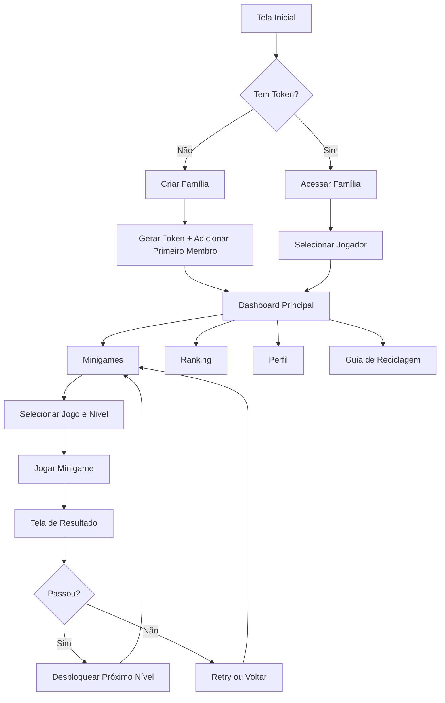
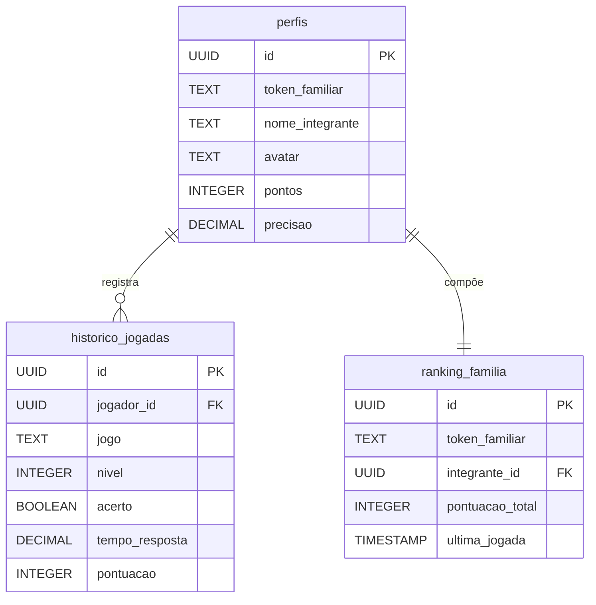

# 🎮 Recycle Show - Sistema de Gamificação para Gestão de Resíduos

[](https://reactjs.org/)
[](https://www.typescriptlang.org/)
[](https://tailwindcss.com/)
[](https://supabase.com/)

## 📋 Sobre o Projeto

**Recycle Show** é uma aplicação web completa e altamente interativa focada em **Educação Ambiental** e **Gestão de Resíduos Urbanos**, desenvolvida especificamente para jovens (12-18 anos) e suas famílias. O sistema combina gamificação, competição familiar e aprendizado sobre reciclagem através de 5 minigames progressivos com 10 níveis cada.

### ✨ Destaques

- 🎨 **Design Gamificado** com paleta de cores da reciclagem (verde, azul, amarelo, vermelho, cinza)
- 👨‍👩‍👧‍👦 **Sistema Familiar Colaborativo** com ranking em tempo real
- 🎯 **5 Minigames Educativos** com progressão gradual de dificuldade
- 📊 **Métricas Detalhadas** com exportação JSON/CSV para análise posterior
- 🔐 **Autenticação via Token Familiar** de 6 caracteres (A-Z, 0-9)
- ♻️ **Guia de Reciclagem Interativo** com curiosidades e dicas práticas
- 🏆 **Sistema de Rankings** familiar e global
- 💾 **Persistência de Dados** com Supabase PostgreSQL

---

## 🖥️ 1. FRONTEND (Interface)

### 🛠️ Tecnologias Utilizadas

| Tecnologia | Versão | Finalidade |
|-----------|--------|-----------|
| **React** | 18.x | Framework principal para UI |
| **TypeScript** | 5.x | Tipagem estática e segurança de código |
| **Tailwind CSS** | 4.0 | Estilização e design responsivo |
| **Vite** | - | Build tool e dev server |
| **Shadcn/UI** | - | Componentes UI reutilizáveis |
| **Lucide React** | - | Ícones modernos |
| **React DnD** | - | Drag-and-drop interativo |
| **Recharts** | - | Gráficos e visualizações |
| **Sonner** | 2.0.3 | Notificações toast |

### 📱 Estrutura de Componentes Principais

#### 🏠 `/App.tsx` - Componente Principal
**Responsabilidades:**
- Gerenciamento de autenticação e sessão
- Navegação entre abas (Minigames, Ranking, Perfil, Guia)
- Controle de troca de jogador
- Adição de novos membros à família
- Exportação de dados

**Funcionalidades:**
```typescript
// Principais estados gerenciados
- tokenFamiliar: string | null          // Token de acesso da família
- currentPlayer: Perfil | null           // Jogador ativo atual
- membros: Perfil[]                      // Todos os membros da família
- activeTab: string                      // Aba ativa do sistema
```

---

#### 🔐 `/components/AuthScreenSupabase.tsx` - Tela de Autenticação
**Dois Modos de Acesso:**

1. **🆕 Criar Nova Família**
   - Nome da família (validação obrigatória)
   - Nome do primeiro integrante
   - Seleção de avatar (12 opções de emojis)
   - Geração automática de Token Familiar único de 6 caracteres

2. **🔑 Acessar Família Existente**
   - Input do Token Familiar (formato: A-Z, 0-9, 6 dígitos)
   - Validação em tempo real
   - Lista todos os membros cadastrados
   - Seleção do jogador para iniciar sessão

---

#### 🎮 `/components/Minigames.tsx` - Hub de Minigames
**Estrutura:**
- Lista expansível dos 5 minigames
- Botões de nível (1-10) com sistema de bloqueio
- Indicador visual de progresso e desbloqueio
- Carregamento dinâmico do progresso do jogador

**Sistema de Progressão:**
```typescript
// Regra de desbloqueio: 90% de acertos para avançar
const PASSING_PERCENTAGE = 90;

// Estrutura de progresso por jogo
progress: {
  quiz: { 1: 100, 2: 95, 3: 0 },      // Nível 1 e 2 completos
  sorting: { 1: 88 },                 // Nível 1 travado (não passou)
  route: {},                          // Não iniciado
  memory: {},
  composting: {}
}
```

---

#### 🧩 Os 5 Minigames

##### 1️⃣ **Quiz de Conhecimento** (`/components/QuizGame.tsx`)
- 🎯 **Objetivo:** Testar conhecimento sobre reciclagem
- 📝 **Mecânica:** Perguntas de múltipla escolha (4 alternativas)
- ⏱️ **Timer:** 30 segundos por questão
- 📊 **Progressão:** 10 perguntas por nível, dificuldade crescente

**Exemplo de Questão:**
```typescript
{
  question: "Qual material NÃO pode ser reciclado?",
  options: ["Papel", "Vidro", "Espelho", "Plástico"],
  correctAnswer: "Espelho",
  category: "Vidros"
}
```

---

##### 2️⃣ **Separação de Resíduos** (`/components/SortingGame.tsx`)
- 🎯 **Objetivo:** Arrastar resíduos para lixeiras corretas
- 🖱️ **Mecânica:** Drag-and-drop com React DnD
- 🗑️ **Lixeiras:** Verde (Vidro), Azul (Papel), Amarela (Metal), Vermelha (Plástico), Cinza (Orgânico)
- 📊 **Progressão:** Quantidade e velocidade aumentam por nível

**Tipos de Resíduo:**
```typescript
const items = [
  { id: 1, name: "Garrafa PET", type: "plastic", emoji: "🥤" },
  { id: 2, name: "Jornal", type: "paper", emoji: "📰" },
  { id: 3, name: "Lata de Alumínio", type: "metal", emoji: "🥫" },
  { id: 4, name: "Garrafa de Vidro", type: "glass", emoji: "🍾" },
  { id: 5, name: "Casca de Banana", type: "organic", emoji: "🍌" }
];
```

---

##### 3️⃣ **Rota de Coleta** (`/components/RouteGame.tsx`)
- 🎯 **Objetivo:** Planejar rota eficiente de coleta de lixo
- 🗺️ **Mecânica:** Puzzle estratégico com grid/mapa visual
- 🚛 **Elementos:** Caminhão de coleta, pontos de lixo, obstáculos
- 📊 **Progressão:** Mapas maiores e mais complexos

---

##### 4️⃣ **Jogo da Memória Ecológica** (`/components/MemoryGame.tsx`)
- 🎯 **Objetivo:** Encontrar pares de cards relacionados à reciclagem
- 🃏 **Mecânica:** Memory game clássico com temática sustentável
- 🎴 **Cards:** Materiais recicláveis, símbolos de reciclagem, ações ecológicas
- 📊 **Progressão:** Mais pares e menor tempo de visualização

---

##### 5️⃣ **Compostagem Inteligente** (`/components/CompostingGame.tsx`)
- 🎯 **Objetivo:** Gerenciar processo de compostagem
- 🌱 **Mecânica:** Classificar resíduos em "Compostável" ou "Não Compostável"
- ⚖️ **Elementos:** Balanço entre materiais secos e úmidos
- 📊 **Progressão:** Mais itens e categorias complexas

---

#### 🏆 `/components/FamilyRanking.tsx` - Sistema de Rankings

**Duas Visualizações:**

1. **🏠 Ranking Familiar**
   - Lista todos os membros da família
   - Ordenação por pontuação total
   - Exibe: posição, avatar, nome, pontos, precisão, última jogada
   - Destaque para o jogador atual

2. **🌍 Ranking Global**
   - Top jogadores de todas as famílias
   - Mesma estrutura de exibição
   - Atualização em tempo real

**Dados Exibidos:**
```typescript
interface RankingEntry {
  posicao: number;
  nome_integrante: string;
  avatar: string;
  pontos: number;
  precisao: number;           // Porcentagem de acertos
  ultima_jogada: string;      // Timestamp
}
```

---

#### 👤 `/components/UserProfile.tsx` - Perfil do Jogador

**Informações Exibidas:**
- 📊 **Estatísticas Gerais**
  - Total de pontos
  - Precisão geral (%)
  - Tempo médio de resposta
  - Total de jogadas

- 📈 **Desempenho por Dificuldade**
  - Fácil: jogadas, acertos, precisão
  - Médio: jogadas, acertos, precisão
  - Difícil: jogadas, acertos, precisão

- 🎮 **Progresso nos Minigames**
  - Visualização de níveis completados por jogo
  - Barra de progresso visual

---

#### 📚 `/components/RecyclingGuide.tsx` - Guia de Reciclagem

**Estrutura:**
- 🗑️ **5 Categorias de Reciclagem**
  - Papel (Azul)
  - Vidro (Verde)
  - Metal (Amarelo)
  - Plástico (Vermelho)
  - Orgânico (Cinza)

- ✅ **Para Cada Categoria:**
  - O que pode reciclar
  - O que NÃO pode reciclar
  - Dicas práticas
  - Curiosidades educativas

**Exemplo de Conteúdo:**
```typescript
{
  color: "blue",
  name: "Papel",
  icon: "📄",
  canRecycle: ["Jornais", "Revistas", "Caixas de papelão"],
  cannotRecycle: ["Papel higiênico", "Guardanapos", "Papel carbono"],
  tips: [
    "Remova fitas adesivas e grampos antes de reciclar",
    "Não amasse o papel para facilitar o processo"
  ],
  facts: [
    "Uma tonelada de papel reciclado evita o corte de 17 árvores"
  ]
}
```

---

#### 🎯 `/components/GameOverScreen.tsx` - Tela de Resultado

**Componente Reutilizável** para todos os minigames

**Props:**
```typescript
interface GameOverScreenProps {
  gameType: 'quiz' | 'sorting' | 'route' | 'memory' | 'composting';
  difficulty: number;
  score: number;
  correctAnswers: number;
  totalQuestions: number;
  timeElapsed: number;
  hasPassed: boolean;
  onRetry: () => void;
  onNext?: () => void;
  onQuit: () => void;
}
```

**Elementos Exibidos:**
- ✅ **Status:** Passou (90%+) ou Falhou
- 🎯 **Pontuação Final**
- 📊 **Precisão Percentual**
- ⏱️ **Tempo Total**
- 🎮 **Ações:** Tentar Novamente | Próximo Nível | Sair

---

### 🔄 Fluxo de Navegação



---

### 🎨 Sistema de Design

**Paleta de Cores da Reciclagem:**
```css
/* Cores Principais */
--recycling-green: #22c55e;   /* Vidro */
--recycling-blue: #3b82f6;    /* Papel */
--recycling-yellow: #eab308;  /* Metal */
--recycling-red: #ef4444;     /* Plástico */
--recycling-gray: #6b7280;    /* Orgânico */

/* Cores de Feedback */
--success: #10b981;
--error: #f59e0b;
--info: #06b6d4;
```

**Tipografia:**
- Font Family: Sistema nativo (sans-serif)
- Configuração customizada em `/styles/globals.css`
- Não usa classes Tailwind de font-size/weight (usa defaults)

---

## ⚙️ 2. BACKEND (API/Servidor)

### 🏗️ Arquitetura

O projeto utiliza **Supabase** como Backend-as-a-Service (BaaS), combinando:
- 🐘 **PostgreSQL** como banco de dados relacional
- 🔐 **Row Level Security (RLS)** para segurança de dados
- ⚡ **Edge Functions** para lógica serverless
- 🔄 **Realtime Subscriptions** para atualizações em tempo real

**Não há servidor backend tradicional** - toda a lógica é executada via:
1. Cliente Supabase (`/lib/supabaseClient.ts`)
2. Funções SQL no banco de dados
3. Edge Functions quando necessário

---

### 📡 Cliente Supabase (`/lib/supabaseClient.ts`)

**Classe Principal:**
```typescript
class SupabaseClient {
  // Métodos de verificação
  verificarConexao()
  tokenFamiliarExiste(token: string)
  
  // Gestão de famílias e membros
  criarFamilia(nomeFamilia: string, primeiroIntegrante: {...})
  adicionarIntegrante(tokenFamiliar: string, novoIntegrante: {...})
  obterMembrosFamilia(tokenFamiliar: string)
  
  // Sistema de jogadas
  registrarJogada(jogada: {...})
  obterHistoricoJogador(jogadorId: string)
  obterProgresso(jogadorId: string)
  
  // Rankings
  obterRankingFamiliar(tokenFamiliar: string)
  obterRankingGlobal(limite: number)
  
  // Exportação de dados
  exportarDadosJogador(jogadorId: string, formato: 'json' | 'csv')
  exportarDadosFamilia(tokenFamiliar: string, formato: 'json' | 'csv')
}
```

---

### 🛣️ Principais Métodos e Responsabilidades

#### 🔐 **Autenticação e Verificação**

##### `verificarConexao()`
**Responsabilidade:** Verificar conectividade e existência de tabelas
```typescript
// Retorna
{
  conectado: boolean;
  tabelasExistem: boolean;
  mensagem: string;
  detalhes?: string;
}
```

##### `tokenFamiliarExiste(token: string)`
**Responsabilidade:** Validar se token familiar existe no banco
```typescript
// Input: "ABC123"
// Output: true | false
```

---

#### 👨‍👩‍👧‍👦 **Gestão de Famílias**

##### `criarFamilia(nomeFamilia, primeiroIntegrante)`
**Responsabilidade:** Criar nova família com primeiro membro
```typescript
// Input
{
  nomeFamilia: "Família Silva",
  primeiroIntegrante: {
    nome: "João Silva",
    avatar: "👨"
  }
}

// Processo:
// 1. Gerar token único de 6 caracteres
// 2. Criar entrada na tabela perfis
// 3. Criar entrada na tabela ranking_familia
// 4. Retornar token gerado

// Output
{
  tokenFamiliar: "XYZ789",
  perfil: { id, nome, avatar, ... }
}
```

##### `adicionarIntegrante(tokenFamiliar, novoIntegrante)`
**Responsabilidade:** Adicionar novo membro à família existente
```typescript
// Input
{
  tokenFamiliar: "XYZ789",
  novoIntegrante: {
    nome: "Maria Silva",
    avatar: "👩"
  }
}

// Output: Perfil do novo membro criado
```

##### `obterMembrosFamilia(tokenFamiliar)`
**Responsabilidade:** Listar todos os membros de uma família
```typescript
// Output: Array de Perfis ordenados por pontuação
[
  {
    id: "uuid-1",
    nome_integrante: "João Silva",
    avatar: "👨",
    pontos: 1500,
    precisao: 92.5,
    ...
  },
  ...
]
```

---

#### 🎮 **Sistema de Jogadas**

##### `registrarJogada(jogada)`
**Responsabilidade:** Salvar jogada e atualizar estatísticas
```typescript
// Input
{
  jogador_id: "uuid-123",
  jogo: "quiz",                    // quiz | sorting | route | memory | composting
  nivel: 3,
  acerto: true,
  tempo_resposta: 12.5,            // segundos
  pontuacao: 100,
  dificuldade: "Médio",            // Fácil | Médio | Difícil
  dados_adicionais: {
    categoria: "Vidros",
    opcao_escolhida: "Garrafa"
  }
}

// Processo Automático (via Triggers):
// 1. Inserir em historico_jogadas
// 2. Atualizar perfil do jogador:
//    - Incrementar total_jogadas
//    - Recalcular pontos totais
//    - Recalcular precisao média
//    - Recalcular tempo_resposta_medio
//    - Atualizar desempenho_por_dificuldade
// 3. Atualizar ranking_familia
```

##### `obterHistoricoJogador(jogadorId, filtros?)`
**Responsabilidade:** Recuperar histórico de jogadas
```typescript
// Filtros opcionais
{
  jogo?: string;
  nivel?: number;
  dataInicio?: string;
  dataFim?: string;
}

// Output: Array de HistoricoJogada
```

##### `obterProgresso(jogadorId)`
**Responsabilidade:** Calcular progresso em cada minigame
```typescript
// Output
{
  quiz: {
    1: 100,      // 100% de acertos no nível 1
    2: 95,       // 95% no nível 2
    3: 88        // 88% no nível 3 (travado, precisa 90%)
  },
  sorting: { ... },
  route: { ... },
  memory: { ... },
  composting: { ... }
}
```

---

#### 🏆 **Sistema de Rankings**

##### `obterRankingFamiliar(tokenFamiliar)`
**Responsabilidade:** Ranking ordenado dos membros da família
```typescript
// Output
[
  {
    posicao: 1,
    nome_integrante: "João Silva",
    avatar: "👨",
    pontos: 2500,
    precisao: 94.2,
    ultima_jogada: "2024-01-15T10:30:00Z"
  },
  ...
]
```

##### `obterRankingGlobal(limite = 100)`
**Responsabilidade:** Top jogadores de todas as famílias
```typescript
// Output: Similar ao ranking familiar, mas inter-familias
```

---

#### 📊 **Exportação de Dados**

##### `exportarDadosJogador(jogadorId, formato)`
**Responsabilidade:** Exportar todas as jogadas de um jogador
```typescript
// Formato JSON
{
  jogador: { id, nome, avatar, ... },
  estatisticas: { pontos, precisao, ... },
  historico: [ { jogo, nivel, acerto, ... }, ... ]
}

// Formato CSV
"timestamp,jogo,nivel,acerto,tempo_resposta,pontuacao,dificuldade\n
2024-01-15T10:30:00Z,quiz,1,true,12.5,100,Fácil\n
..."
```

##### `exportarDadosFamilia(tokenFamiliar, formato)`
**Responsabilidade:** Exportar dados de toda a família
```typescript
// Inclui dados de todos os membros + estatísticas agregadas
```

---

### 🔒 Regras de Negócio Principais

#### 1️⃣ **Sistema de Progressão**
```typescript
// Regra: Precisa 90% de acertos para desbloquear próximo nível
const PASSING_PERCENTAGE = 90;

// Exemplo de cálculo
function calcularProgresso(nivel: number, jogo: string, jogadorId: string) {
  // 1. Buscar todas as jogadas do nível
  // 2. Calcular % de acertos
  // 3. Se >= 90%, desbloquear próximo nível
  // 4. Atualizar estado de progresso
}
```

#### 2️⃣ **Sistema de Pontuação**
```typescript
// Pontos baseados em:
// - Acerto/Erro
// - Tempo de resposta
// - Dificuldade do nível

function calcularPontos(acerto: boolean, tempoResposta: number, dificuldade: string) {
  if (!acerto) return 0;
  
  const basePontos = {
    'Fácil': 50,
    'Médio': 100,
    'Difícil': 200
  }[dificuldade];
  
  // Bônus por rapidez (máximo +50%)
  const bonusTempo = Math.max(0, 1 - (tempoResposta / 30)) * 0.5;
  
  return Math.floor(basePontos * (1 + bonusTempo));
}
```

#### 3️⃣ **Validação de Token Familiar**
```sql
-- Constraint no banco de dados
CONSTRAINT token_familiar_format CHECK (
    token_familiar ~ '^[A-Z0-9]{6}$'
)
```

#### 4️⃣ **Atualização Automática de Estatísticas**
```typescript
// Triggers SQL que atualizam automaticamente:
// - perfis.pontos
// - perfis.precisao
// - perfis.tempo_resposta_medio
// - perfis.desempenho_por_dificuldade
// - ranking_familia.pontuacao_total
// - ranking_familia.ultima_jogada

// Sempre que uma jogada é registrada
```

---

## 💾 3. BANCO DE DADOS

### 🐘 Tecnologia: PostgreSQL (via Supabase)

**Características:**
- Banco relacional com suporte a JSONB
- Row Level Security (RLS) habilitado
- Triggers automáticos para estatísticas
- Funções SQL customizadas
- Índices otimizados para performance

---

### 📊 Estrutura de Tabelas

#### 🗂️ **Tabela 1: `perfis`** (Perfil do Jogador)

**Descrição:** Armazena informações e estatísticas de cada jogador

```sql
CREATE TABLE perfis (
    -- Identificação
    id UUID PRIMARY KEY DEFAULT gen_random_uuid(),
    nome_integrante TEXT NOT NULL,
    avatar TEXT DEFAULT '👤',
    token_familiar TEXT NOT NULL,
    
    -- Estatísticas de Jogo
    pontos INTEGER DEFAULT 0,
    precisao DECIMAL(5,2) DEFAULT 0.00,          -- Porcentagem 0-100
    tempo_resposta_medio DECIMAL(10,2) DEFAULT 0.00,  -- Segundos
    total_jogadas INTEGER DEFAULT 0,
    
    -- Desempenho Detalhado por Dificuldade
    desempenho_por_dificuldade JSONB DEFAULT '{
        "facil": {"jogadas": 0, "acertos": 0, "precisao": 0},
        "medio": {"jogadas": 0, "acertos": 0, "precisao": 0},
        "dificil": {"jogadas": 0, "acertos": 0, "precisao": 0}
    }'::jsonb,
    
    -- Metadados
    created_at TIMESTAMP WITH TIME ZONE DEFAULT NOW(),
    updated_at TIMESTAMP WITH TIME ZONE DEFAULT NOW(),
    
    -- Constraints
    CONSTRAINT token_familiar_format CHECK (token_familiar ~ '^[A-Z0-9]{6}$'),
    CONSTRAINT precisao_range CHECK (precisao >= 0 AND precisao <= 100),
    CONSTRAINT pontos_positive CHECK (pontos >= 0)
);

-- Índices para performance
CREATE INDEX idx_perfis_token ON perfis(token_familiar);
CREATE INDEX idx_perfis_pontos ON perfis(pontos DESC);
```

**Campos Principais:**

| Campo | Tipo | Descrição |
|-------|------|-----------|
| `id` | UUID | Identificador único do jogador |
| `nome_integrante` | TEXT | Nome do jogador |
| `avatar` | TEXT | Emoji representando o jogador |
| `token_familiar` | TEXT | Token de 6 caracteres da família |
| `pontos` | INTEGER | Pontuação total acumulada |
| `precisao` | DECIMAL | Percentual médio de acertos (0-100) |
| `tempo_resposta_medio` | DECIMAL | Tempo médio em segundos |
| `total_jogadas` | INTEGER | Quantidade total de jogadas |
| `desempenho_por_dificuldade` | JSONB | Estatísticas segmentadas por nível |

**Exemplo de Registro:**
```json
{
  "id": "550e8400-e29b-41d4-a716-446655440000",
  "nome_integrante": "João Silva",
  "avatar": "👨",
  "token_familiar": "ABC123",
  "pontos": 2500,
  "precisao": 92.5,
  "tempo_resposta_medio": 15.3,
  "total_jogadas": 87,
  "desempenho_por_dificuldade": {
    "facil": {
      "jogadas": 30,
      "acertos": 29,
      "precisao": 96.67
    },
    "medio": {
      "jogadas": 40,
      "acertos": 37,
      "precisao": 92.5
    },
    "dificil": {
      "jogadas": 17,
      "acertos": 14,
      "precisao": 82.35
    }
  }
}
```

---

#### 📜 **Tabela 2: `historico_jogadas`** (Logs de Minigame)

**Descrição:** Registra cada jogada individual de cada jogador

```sql
CREATE TABLE historico_jogadas (
    -- Identificação
    id UUID PRIMARY KEY DEFAULT gen_random_uuid(),
    jogador_id UUID NOT NULL REFERENCES perfis(id) ON DELETE CASCADE,
    
    -- Detalhes do Jogo
    jogo TEXT NOT NULL,  -- 'quiz' | 'sorting' | 'route' | 'memory' | 'composting'
    nivel INTEGER NOT NULL DEFAULT 1,
    
    -- Resultado da Jogada
    acerto BOOLEAN NOT NULL,
    tempo_resposta DECIMAL(10,2) NOT NULL,
    pontuacao INTEGER NOT NULL DEFAULT 0,
    dificuldade TEXT NOT NULL DEFAULT 'Médio',  -- 'Fácil' | 'Médio' | 'Difícil'
    
    -- Dados Adicionais (flexível para cada tipo de jogo)
    dados_adicionais JSONB DEFAULT '{}'::jsonb,
    
    -- Metadados
    timestamp TIMESTAMP WITH TIME ZONE DEFAULT NOW(),
    
    -- Constraints
    CONSTRAINT nivel_positive CHECK (nivel >= 1 AND nivel <= 10),
    CONSTRAINT tempo_resposta_positive CHECK (tempo_resposta > 0),
    CONSTRAINT dificuldade_valida CHECK (dificuldade IN ('Fácil', 'Médio', 'Difícil')),
    CONSTRAINT jogo_valido CHECK (jogo IN ('quiz', 'sorting', 'memory', 'route', 'composting'))
);

-- Índices para performance
CREATE INDEX idx_historico_jogador ON historico_jogadas(jogador_id);
CREATE INDEX idx_historico_timestamp ON historico_jogadas(timestamp DESC);
CREATE INDEX idx_historico_jogo ON historico_jogadas(jogo);
```

**Campos Principais:**

| Campo | Tipo | Descrição |
|-------|------|-----------|
| `id` | UUID | Identificador único da jogada |
| `jogador_id` | UUID | FK para perfis(id) |
| `jogo` | TEXT | Tipo de minigame |
| `nivel` | INTEGER | Nível jogado (1-10) |
| `acerto` | BOOLEAN | Se acertou ou errou |
| `tempo_resposta` | DECIMAL | Tempo em segundos |
| `pontuacao` | INTEGER | Pontos ganhos nesta jogada |
| `dificuldade` | TEXT | Fácil/Médio/Difícil |
| `dados_adicionais` | JSONB | Metadados específicos do jogo |
| `timestamp` | TIMESTAMP | Quando ocorreu a jogada |

**Exemplo de `dados_adicionais` por jogo:**

```typescript
// Quiz
{
  "pergunta": "Qual material pode ser reciclado?",
  "opcao_escolhida": "Vidro",
  "opcao_correta": "Vidro",
  "categoria": "Vidros"
}

// Sorting
{
  "item": "Garrafa PET",
  "lixeira_escolhida": "plastic",
  "lixeira_correta": "plastic"
}

// Route
{
  "movimentos": 15,
  "rota_otima": 12,
  "eficiencia": 0.8
}

// Memory
{
  "tentativas": 8,
  "pares_encontrados": 6,
  "tempo_por_par": 5.2
}

// Composting
{
  "item": "Casca de Banana",
  "classificacao": "compostavel",
  "tipo": "umido"
}
```

---

#### 🏆 **Tabela 3: `ranking_familia`** (Ranking por Família)

**Descrição:** Mantém pontuação agregada por família para ranking

```sql
CREATE TABLE ranking_familia (
    id UUID PRIMARY KEY DEFAULT gen_random_uuid(),
    token_familiar TEXT NOT NULL,
    nome_familia TEXT NOT NULL,
    integrante_id UUID NOT NULL REFERENCES perfis(id) ON DELETE CASCADE,
    pontuacao_total INTEGER DEFAULT 0,
    ultima_jogada TIMESTAMP WITH TIME ZONE,
    created_at TIMESTAMP WITH TIME ZONE DEFAULT NOW(),
    
    -- Constraint de unicidade
    CONSTRAINT unique_familia_integrante UNIQUE (token_familiar, integrante_id)
);

-- Índices
CREATE INDEX idx_ranking_token ON ranking_familia(token_familiar);
CREATE INDEX idx_ranking_pontuacao ON ranking_familia(pontuacao_total DESC);
```

**Campos Principais:**

| Campo | Tipo | Descrição |
|-------|------|-----------|
| `token_familiar` | TEXT | Token da família |
| `nome_familia` | TEXT | Nome da família |
| `integrante_id` | UUID | FK para perfis(id) |
| `pontuacao_total` | INTEGER | Soma dos pontos do integrante |
| `ultima_jogada` | TIMESTAMP | Última atividade do integrante |

---

### 🔗 Relacionamentos Entre Tabelas



**Descrição dos Relacionamentos:**

1. **perfis → historico_jogadas** (1:N)
   - Um jogador tem muitas jogadas
   - FK: `historico_jogadas.jogador_id` → `perfis.id`
   - ON DELETE CASCADE (se jogador for deletado, todas as jogadas são removidas)

2. **perfis → ranking_familia** (1:1)
   - Cada jogador tem uma entrada no ranking da sua família
   - FK: `ranking_familia.integrante_id` → `perfis.id`
   - Constraint UNIQUE para evitar duplicatas

3. **Agrupamento por Token Familiar**
   - Múltiplos perfis compartilham o mesmo `token_familiar`
   - Permite queries de ranking familiar e gestão de grupos

---

### ⚡ Funções SQL Importantes

#### 🔧 **1. `gerar_token_familiar()`**
**Responsabilidade:** Gerar token único de 6 caracteres

```sql
CREATE OR REPLACE FUNCTION gerar_token_familiar()
RETURNS TEXT AS $$
DECLARE
    chars TEXT := 'ABCDEFGHIJKLMNOPQRSTUVWXYZ0123456789';
    token TEXT := '';
    i INTEGER;
BEGIN
    FOR i IN 1..6 LOOP
        token := token || substr(chars, floor(random() * length(chars) + 1)::int, 1);
    END LOOP;
    
    -- Verificar se já existe (recursivo se existir)
    IF EXISTS (SELECT 1 FROM perfis WHERE token_familiar = token) THEN
        RETURN gerar_token_familiar();
    END IF;
    
    RETURN token;
END;
$$ LANGUAGE plpgsql;
```

---

#### 📊 **2. `atualizar_estatisticas_perfil()`**
**Responsabilidade:** Trigger para atualizar estatísticas após cada jogada

```sql
CREATE OR REPLACE FUNCTION atualizar_estatisticas_perfil()
RETURNS TRIGGER AS $$
BEGIN
    -- Atualizar estatísticas do perfil
    UPDATE perfis SET
        total_jogadas = total_jogadas + 1,
        pontos = pontos + NEW.pontuacao,
        precisao = (
            SELECT (COUNT(*) FILTER (WHERE acerto = true)::DECIMAL / COUNT(*)) * 100
            FROM historico_jogadas
            WHERE jogador_id = NEW.jogador_id
        ),
        tempo_resposta_medio = (
            SELECT AVG(tempo_resposta)
            FROM historico_jogadas
            WHERE jogador_id = NEW.jogador_id
        ),
        updated_at = NOW()
    WHERE id = NEW.jogador_id;
    
    RETURN NEW;
END;
$$ LANGUAGE plpgsql;

-- Criar trigger
CREATE TRIGGER trigger_atualizar_perfil
AFTER INSERT ON historico_jogadas
FOR EACH ROW
EXECUTE FUNCTION atualizar_estatisticas_perfil();
```

---

#### 🏆 **3. `atualizar_ranking_familia()`**
**Responsabilidade:** Atualizar ranking após jogada

```sql
CREATE OR REPLACE FUNCTION atualizar_ranking_familia()
RETURNS TRIGGER AS $$
DECLARE
    v_token TEXT;
BEGIN
    -- Buscar token familiar do jogador
    SELECT token_familiar INTO v_token
    FROM perfis
    WHERE id = NEW.jogador_id;
    
    -- Atualizar ranking
    UPDATE ranking_familia SET
        pontuacao_total = (
            SELECT pontos FROM perfis WHERE id = NEW.jogador_id
        ),
        ultima_jogada = NOW()
    WHERE integrante_id = NEW.jogador_id;
    
    RETURN NEW;
END;
$$ LANGUAGE plpgsql;

CREATE TRIGGER trigger_atualizar_ranking
AFTER INSERT ON historico_jogadas
FOR EACH ROW
EXECUTE FUNCTION atualizar_ranking_familia();
```

---

### 🔐 Row Level Security (RLS)

**Políticas de Segurança:**

```sql
-- Habilitar RLS
ALTER TABLE perfis ENABLE ROW LEVEL SECURITY;
ALTER TABLE historico_jogadas ENABLE ROW LEVEL SECURITY;
ALTER TABLE ranking_familia ENABLE ROW LEVEL SECURITY;

-- Políticas de leitura/escrita
-- (Simplificado - permite acesso público para MVP educacional)
CREATE POLICY "Acesso público perfis" ON perfis FOR ALL USING (true);
CREATE POLICY "Acesso público historico" ON historico_jogadas FOR ALL USING (true);
CREATE POLICY "Acesso público ranking" ON ranking_familia FOR ALL USING (true);
```

⚠️ **Nota de Segurança:** Para ambiente de produção, implementar políticas mais restritivas baseadas em `token_familiar` e autenticação.

---

## 🧩 Módulos Reutilizáveis (Clean Code)

### 📦 `/lib/gameUtils.ts`
**Funções utilitárias compartilhadas entre minigames**

```typescript
// Constantes
export const AVATARS = ['👨', '👩', '👦', '👧', ...];
export const PASSING_PERCENTAGE = 90;

// Funções principais
shuffleArray<T>(array: T[]): T[]              // Embaralhar array
calculatePercentage(correct, total): number   // Calcular %
hasPassed(correct, total): boolean            // Verificar 90%+
getDifficultyLevel(difficulty: number): string // 1-10 → Fácil/Médio/Difícil
savePendingMoves(moves, playerId, ...): void  // Salvar jogadas em lote
clearSessionData(): void                      // Limpar localStorage
formatTime(seconds): string                   // Formatar MM:SS
```

---

### 🎮 `/lib/usePendingMoves.ts`
**Hook customizado para gerenciar jogadas pendentes**

```typescript
export function usePendingMoves() {
  const [pendingMoves, setPendingMoves] = useState<PendingMove[]>([]);

  const addMove = (move: PendingMove) => {
    setPendingMoves(prev => [...prev, move]);
  };

  const clearMoves = () => {
    setPendingMoves([]);
  };

  return { pendingMoves, addMove, clearMoves };
}
```

**Uso nos minigames:**
```typescript
const { pendingMoves, addMove, clearMoves } = usePendingMoves();

// Durante o jogo
addMove({
  acerto: true,
  tempo_resposta: 12.5,
  pontuacao: 100,
  dados_adicionais: { ... }
});

// Ao finalizar
await savePendingMoves(pendingMoves, playerId, gameType, difficulty);
clearMoves();
```

---

### 🏆 `/components/GameOverScreen.tsx`
**Componente reutilizado por todos os 5 minigames**

**Benefícios:**
- ✅ Elimina duplicação de código
- ✅ Interface consistente
- ✅ Manutenção centralizada
- ✅ Feedback padronizado de resultados

---

## 📂 Estrutura de Diretórios

```
recycle-show/
├── /components/
│   ├── /ui/                    # Componentes Shadcn/UI
│   │   ├── button.tsx
│   │   ├── card.tsx
│   │   ├── tabs.tsx
│   │   └── ...
│   ├── AuthScreenSupabase.tsx  # Tela de autenticação
│   ├── Minigames.tsx           # Hub de minigames
│   ├── QuizGame.tsx            # Minigame 1
│   ├── SortingGame.tsx         # Minigame 2
│   ├── RouteGame.tsx           # Minigame 3
│   ├── MemoryGame.tsx          # Minigame 4
│   ├── CompostingGame.tsx      # Minigame 5
│   ├── FamilyRanking.tsx       # Ranking familiar/global
│   ├── UserProfile.tsx         # Perfil do jogador
│   ├── RecyclingGuide.tsx      # Guia de reciclagem
│   ├── GameOverScreen.tsx      # Tela de resultado (reutilizável)
│   ├── GameCard.tsx            # Card de seleção de jogo
│   ├── Logo.tsx                # Logo do app
│   └── PlayerContextSupabase.tsx # Context API para jogador
│
├── /lib/
│   ├── supabaseClient.ts       # Cliente e API do Supabase
│   ├── gameUtils.ts            # Utilitários compartilhados
│   ├── usePendingMoves.ts      # Hook de jogadas pendentes
│   └── mockData.ts             # Dados mockados para testes
│
├── /supabase/
│   ├── schema.sql              # Schema completo do banco
│   ├── fix_rls_policies.sql    # Políticas de segurança
│   └── README_SQL.md           # Documentação do banco
│
├── /styles/
│   └── globals.css             # Estilos globais e tokens
│
├── /utils/
│   └── /supabase/
│       └── info.tsx            # Credenciais do Supabase
│
├── App.tsx                     # Componente principal
├── README.md                   # Esta documentação
└── package.json
```

---

## 🚀 Como Executar o Projeto

### 📋 Pré-requisitos

- Node.js 18+ instalado
- Conta no [Supabase](https://supabase.com/) (gratuita)
- Git

---

### ⚙️ Configuração

#### 1️⃣ **Clone o Repositório**
```bash
git clone <url-do-repositorio>
cd recycle-show
```

#### 2️⃣ **Instale as Dependências**
```bash
npm install
```

#### 3️⃣ **Configure o Supabase**

**a) Crie um projeto no Supabase:**
- Acesse https://supabase.com/
- Crie novo projeto
- Anote o `Project ID` e `Anon Public Key`

**b) Configure as credenciais:**
Edite o arquivo `/utils/supabase/info.tsx`:

```typescript
export const projectId = 'SEU_PROJECT_ID_AQUI';
export const publicAnonKey = 'SUA_ANON_KEY_AQUI';
```

**c) Execute o Schema SQL:**
- No dashboard do Supabase, vá em **SQL Editor**
- Copie todo o conteúdo de `/supabase/schema.sql`
- Execute o script
- Verifique se as 3 tabelas foram criadas: `perfis`, `historico_jogadas`, `ranking_familia`

---

#### 4️⃣ **Execute o Projeto**

**Modo Desenvolvimento:**
```bash
npm run dev
```

**Build para Produção:**
```bash
npm run build
npm run preview
```

Acesse: `http://localhost:5173`

---

## 📊 Exportação de Dados

### 📥 Funcionalidades de Exportação

**1. Exportar Dados do Jogador:**
```typescript
// Formato JSON
const dados = await supabaseClient.exportarDadosJogador(playerId, 'json');

// Formato CSV
const csv = await supabaseClient.exportarDadosJogador(playerId, 'csv');
```

**2. Exportar Dados da Família:**
```typescript
const dadosFamilia = await supabaseClient.exportarDadosFamilia(tokenFamiliar, 'json');
```

**Dados Exportados:**
- ✅ Perfil completo do jogador
- ✅ Todas as estatísticas
- ✅ Histórico completo de jogadas
- ✅ Progresso em cada minigame
- ✅ Desempenho por dificuldade
- ✅ Timestamps de cada ação

---

## 🧪 Testes e Validação

### 🔍 Verificar Conexão com Banco

```typescript
const status = await supabaseClient.verificarConexao();
console.log(status);
// {
//   conectado: true,
//   tabelasExistem: true,
//   mensagem: "Conexão bem-sucedida!"
// }
```

### 🎮 Testar Fluxo Completo

1. **Criar Família**
   - Criar nova família "Família Teste"
   - Verificar geração de token de 6 caracteres
   - Confirmar criação do primeiro membro

2. **Adicionar Membros**
   - Adicionar 2-3 membros adicionais
   - Verificar listagem de membros

3. **Jogar Minigames**
   - Completar nível 1 do Quiz (90%+ para desbloquear)
   - Verificar desbloqueio do nível 2
   - Testar os 5 minigames diferentes

4. **Verificar Rankings**
   - Confirmar atualização automática
   - Verificar ordenação por pontos
   - Testar ranking familiar e global

5. **Exportar Dados**
   - Exportar em JSON e CSV
   - Validar integridade dos dados

---

## 🎯 Métricas Coletadas

### 📈 Por Jogada Individual
- Jogo e nível jogado
- Acerto/erro
- Tempo de resposta
- Pontuação obtida
- Dificuldade
- Dados específicos do jogo
- Timestamp

### 📊 Por Jogador (Agregado)
- Total de pontos
- Precisão geral (%)
- Tempo médio de resposta
- Total de jogadas
- Desempenho por dificuldade (Fácil/Médio/Difícil)
- Progresso em cada minigame (% por nível)

### 👨‍👩‍👧‍👦 Por Família (Agregado)
- Ranking dos membros
- Pontuação total da família
- Última atividade de cada membro
- Estatísticas comparativas

---

## 🛠️ Manutenção e Boas Práticas

### ✅ Clean Code Aplicado

**Princípios Seguidos:**
- ✅ **DRY (Don't Repeat Yourself):** Criação de `gameUtils.ts` e `usePendingMoves.ts`
- ✅ **Single Responsibility:** Cada componente tem uma responsabilidade clara
- ✅ **Separation of Concerns:** Lógica de negócio separada da UI
- ✅ **Reusabilidade:** `GameOverScreen.tsx` usado por todos os minigames
- ✅ **Tipagem Forte:** TypeScript em todo o projeto
- ✅ **Nomenclatura Clara:** Nomes descritivos e auto-explicativos

### 📝 Padrões de Código

```typescript
// ✅ BOM: Função pura, reutilizável, tipada
export function calculatePercentage(correct: number, total: number): number {
  if (total === 0) return 0;
  return (correct / total) * 100;
}

// ❌ RUIM: Lógica duplicada em cada componente
const percentage = (correctAnswers / totalQuestions) * 100;
```

---

## 🐛 Troubleshooting

### ❗ Erro: "Supabase não conectado"
**Solução:**
1. Verifique as credenciais em `/utils/supabase/info.tsx`
2. Confirme que o projeto do Supabase está ativo
3. Execute novamente o schema SQL

---

### ❗ Erro: "Token familiar inválido"
**Solução:**
1. Token deve ter exatamente 6 caracteres
2. Apenas A-Z e 0-9 são válidos
3. Verifique se o token existe no banco: `SELECT * FROM perfis WHERE token_familiar = 'SEU_TOKEN'`

---

### ❗ Progresso não está salvando
**Solução:**
1. Verifique se os triggers estão criados: `\df` no SQL Editor
2. Confirme que `pendingMoves` está sendo enviado ao finalizar o jogo
3. Verifique logs do console para erros de rede

---

### ❗ Rankings não atualizam
**Solução:**
1. Verifique se a tabela `ranking_familia` foi criada
2. Confirme que os triggers estão ativos
3. Force atualização manual: `SELECT * FROM ranking_familia WHERE token_familiar = 'SEU_TOKEN'`

---

## 📚 Recursos Adicionais

### 📖 Documentação de Referência
- [React Documentation](https://react.dev/)
- [TypeScript Handbook](https://www.typescriptlang.org/docs/)
- [Tailwind CSS Docs](https://tailwindcss.com/docs)
- [Supabase Docs](https://supabase.com/docs)
- [Shadcn/UI Components](https://ui.shadcn.com/)

### 🗂️ Arquivos de Documentação do Projeto
- `/REFATORACAO_CLEAN_CODE.md` - Detalhes da refatoração
- `/supabase/README_SQL.md` - Documentação do banco de dados
- `/LEIA_ME.md` - Instruções gerais

---

## 🤝 Contribuindo

Para contribuir com o projeto:

1. Fork o repositório
2. Crie uma branch para sua feature (`git checkout -b feature/NovaFuncionalidade`)
3. Commit suas mudanças (`git commit -m 'Adiciona nova funcionalidade'`)
4. Push para a branch (`git push origin feature/NovaFuncionalidade`)
5. Abra um Pull Request

**Padrões de Commit:**
- `feat:` Nova funcionalidade
- `fix:` Correção de bug
- `refactor:` Refatoração de código
- `docs:` Atualização de documentação
- `style:` Mudanças de formatação

---

## 📄 Licença

Este projeto é um protótipo educacional desenvolvido para fins de aprendizado sobre gestão de resíduos e reciclagem.

---

## 👥 Equipe

Desenvolvido como projeto educacional de gamificação ambiental.

---

## 📞 Suporte

Para dúvidas ou problemas:
1. Consulte a seção de [Troubleshooting](#-troubleshooting)
2. Verifique os logs do console do navegador
3. Consulte os logs do Supabase no dashboard
4. Abra uma issue no repositório

---

## 🎉 Agradecimentos

- **Shadcn/UI** pelos componentes reutilizáveis
- **Supabase** pela infraestrutura de backend
- **React Community** pelas ferramentas e bibliotecas
- **Educadores Ambientais** pela inspiração do conteúdo educativo

---

**🌱 Recycle Show - Educação Ambiental através da Gamificação 🎮**

*Versão 1.0 | Última atualização: 2024*
